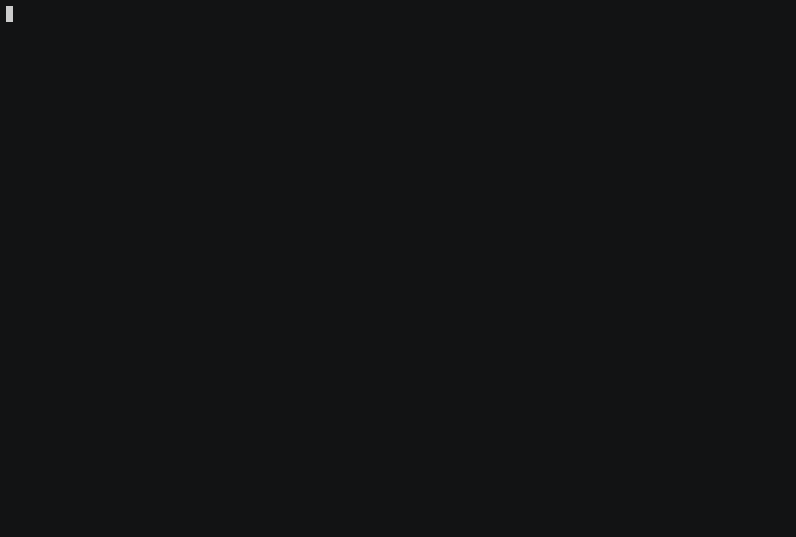

# Should The Grizzly Bear Eat The Salmon?
https://fivethirtyeight.com/features/should-the-grizzly-bear-eat-the-salmon/

A grizzly bear stands in the shallows of a river during salmon spawning season. Precisely once every hour, a fish swims within its reach. The bear can either catch the fish and eat it, or let it swim past to safety. This grizzly is, as many grizzlies are, persnickety. It’ll only eat fish that are at least as big as every fish it ate before.

Each fish weighs some amount, randomly and uniformly distributed between 0 and 1 kilogram. (Each fish’s weight is independent of the others, and the skilled bear can tell how much each weighs just by looking at it.) The bear wants to maximize its intake of salmon, as measured in kilograms. Suppose the bear’s fishing expedition is two hours long. Under what circumstances should it eat the first fish within its reach? What if the expedition is three hours long?


## Prerequisites
Install Elixir:
http://elixir-lang.org/install.html

## Assumptions
Version 1 of this simulation assumes that grams are the smallest unit of weight. Thus, there are 1000 possible sizes, from 1 gram to 1000 grams.

In the future, There might be macros that can handle different units as well.

__Threshold__ refers to the maximum weight of the first fish the grizzly is willing to eats.

## Statistics and Other Notes
The simulation calculates the expected value each threshold using brute force.  

The higher the EV Significance, the longer this will take to run. For initial tests, start with a significance of 10.  
A more realistic test will probably require a significance of > 100,000.


## To Run Simulation
```bash
$ mix grizzly.simulate
How many times to run the simulation? Higher means more accurate expected value, but slower? [Please Enter Integer]
1000
```
[](https://asciinema.org/a/82662?autoplay=1)

You
The results will be outputted to results/grams/result-{threshold}.csv in a new row.


## How to view results:
Click [here](./results/grams/grizzly-results-10.csv) to see the CSV of sample runs  

##### Legend:  
Threshold: What was the max size of the first fish the bear is willing to eat in grams?
Hours: How long was the expedition (How many fishes did the Grizzly see?)  
EV: What is the expected value of fishes eaten in grams for a certain threshold.  
significance: How many tries did the simulation run at each threshold.  


## Pre Generated Expected Values, by hours and threshold
Since generating the EV can take a rather long time of the work, I've pre generated a whole bunch of them. Feel free to use that set for any analysis.  
The file scheme is `results/grams/#{hours}/ev-#{hours}-#{significance}.csv`.  
For example, `ev-2-10000.csv` means it was ran with 10000 tries (significance) to get the expected value at each threshold with 2 hour long expedition.

Click [here](./results/grams/2-hours/ev-2-10000.csv) to see the CSV of sample runs  

## Generate your own csv for further Experimentation:
To generate your own csv, run the following command. You will be prompted to input two values in Integer form.

[](https://asciinema.org/a/82663?autoplay=1)
```bash
$ mix grizzly.simulate.single
Expedition length in hours (how many fishes will you see)? [Please Enter Integer]
2
How many times to run this to generate an Expected Value? [Please Enter Integer]
200
```
